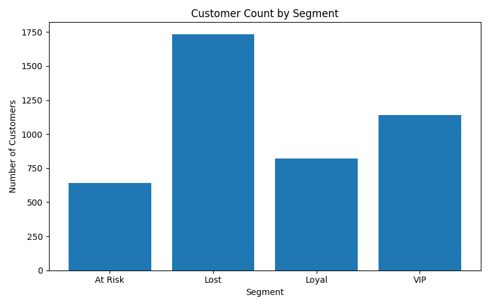
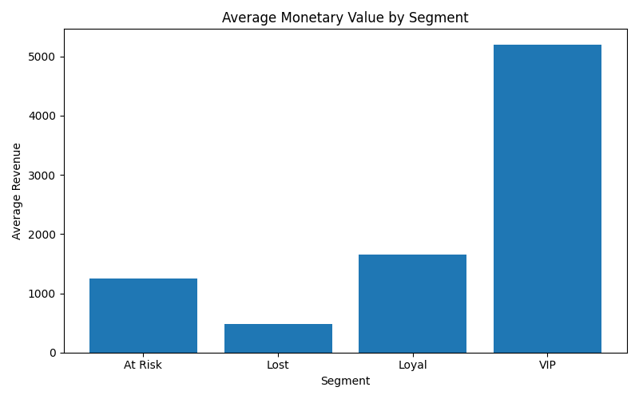
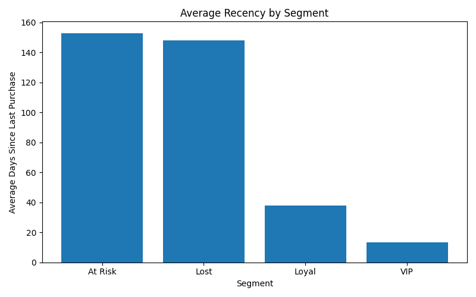
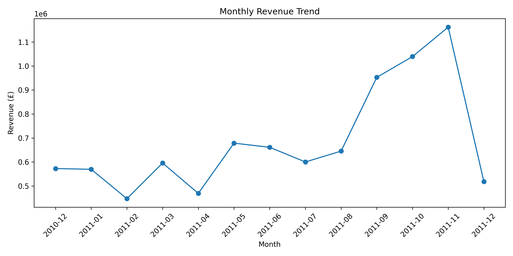

# 🌌 DarkMatter Analytics

### Find the Invisible Revenue Hiding in Your E-Commerce Data

DarkMatter Analytics is an end-to-end analytics engineering project designed to uncover hidden revenue opportunities within e-commerce transaction data.

Inspired by the concept of dark matter in space—valuable yet invisible—this project identifies high-value customers, at-risk customers, purchasing patterns, and revenue trends using SQL, PostgreSQL, Python, and customer segmentation techniques.

---

## 📌 Project Objectives

This project answers key business questions:

* Who are the highest-value customers?
* Which customers are likely to stop purchasing?
* Which products generate the most revenue?
* How does revenue change over time?
* Which customer segments should be targeted for retention campaigns?
* Where is hidden revenue being lost?

---

## 🏗️ Architecture

```text
Online Retail Dataset
        ↓
Data Cleaning (Python)
        ↓
Warehouse Tables
(Customers, Products, Orders, Order_Items)
        ↓
PostgreSQL Data Warehouse
        ↓
SQL Analytics
        ↓
RFM Segmentation
        ↓
Business Insights
        ↓
Visualizations & Dashboards
```

---

## 📊 Dataset

**Source:** UCI Online Retail Dataset

Dataset Characteristics:

* 541,909 transactions
* 4,338 customers
* 18,532 orders
* 8,881 products

Features include:

* Invoice Number
* Customer ID
* Product Description
* Quantity
* Unit Price
* Invoice Date
* Country

---

## 🧹 Data Cleaning

The following preprocessing steps were performed:

* Removed missing Customer IDs
* Removed missing product descriptions
* Removed cancelled orders
* Removed negative quantities
* Removed invalid prices
* Converted dates into datetime format
* Created Revenue column

Revenue Calculation:

Revenue = Quantity × UnitPrice

---

## 🗄️ Data Warehouse Design

### Customers

| Column     |
| ---------- |
| CustomerID |
| Country    |

### Products

| Column      |
| ----------- |
| StockCode   |
| Description |
| UnitPrice   |

### Orders

| Column      |
| ----------- |
| InvoiceNo   |
| CustomerID  |
| InvoiceDate |

### Order Items

| Column    |
| --------- |
| InvoiceNo |
| StockCode |
| Quantity  |
| UnitPrice |
| Revenue   |

---

## 📈 SQL Analytics

### Top Revenue Customers

| Customer ID | Revenue (£) |
| ----------- | ----------- |
| 14646       | 280,206     |
| 18102       | 259,657     |
| 17450       | 194,551     |

### Top Revenue Products

| Product                            | Revenue (£) |
| ---------------------------------- | ----------- |
| PAPER CRAFT, LITTLE BIRDIE         | 168,469     |
| REGENCY CAKESTAND 3 TIER           | 142,593     |
| WHITE HANGING HEART T-LIGHT HOLDER | 100,448     |

### Revenue Trend

Revenue increased significantly during Q4 2011:

* September: £952K
* October: £1.03M
* November: £1.16M

This indicates strong seasonal purchasing behavior.

---

## 🎯 RFM Segmentation

RFM stands for:

* Recency
* Frequency
* Monetary Value

Customer segments were created based on purchasing behavior.

### Segment Distribution

| Segment | Customers |
| ------- | --------- |
| Lost    | 1,735     |
| VIP     | 1,139     |
| Loyal   | 821       |
| At Risk | 643       |

### Segment Insights

VIP Customers:

* Average Revenue: £5,204
* Average Orders: 10
* Average Recency: 13 Days

At-Risk Customers:

* Average Revenue: £1,245
* Average Orders: 3.4
* Average Recency: 153 Days

These customers represent hidden revenue opportunities for re-engagement campaigns.

---

## 📸 Visualizations

Project visualizations include:

* Customer Count by Segment
* Average Monetary Value by Segment
* Average Recency by Segment
* Monthly Revenue Trend

Screenshots can be found in the screenshots folder.

---

## 📸 Project Screenshots

### Customer Count by Segment



### Average Monetary Value by Segment



### Average Recency by Segment



### Monthly Revenue Trend



---

## 🛠️ Tech Stack

* Python
* Pandas
* PostgreSQL
* SQL
* Matplotlib
* Jupyter Notebook

---

## 🚀 Key Business Outcomes

* Identified high-value customer segments
* Detected at-risk customers for retention strategies
* Revealed seasonal revenue trends
* Designed a relational data warehouse
* Performed SQL-based business analytics
* Generated actionable customer insights

---

## 👨‍💻 Author

Shreya Karamchedu

Master's in Computer Science
California State University, San Bernardino
